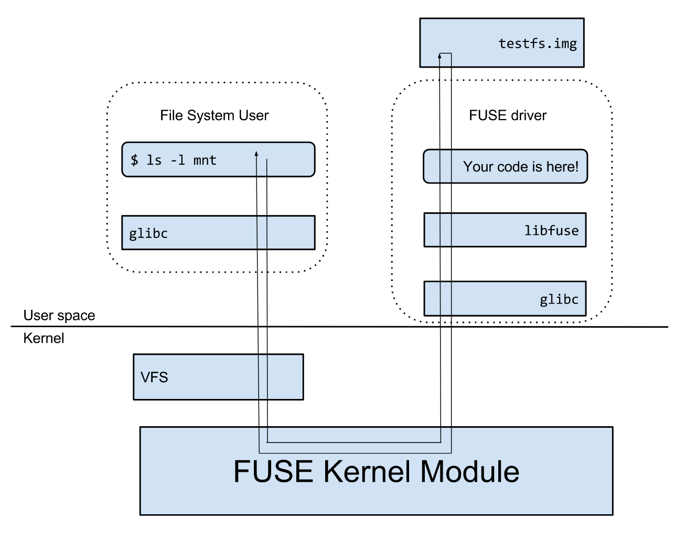

## What is fuse 3 ??

Fuse 3 (often written as FUSE3 or libfuse3) is the current major version of Filesystem in Userspace, a Linux interface that lets user-space programs implement filesystems and mount them without writing kernel code. It consists of a kernel module plus a user-space library (libfuse3) and tools like fusermount3 and mount.fuse3 to manage FUSE mounts.


### Big picture

Applications make system calls like open, read, write, getattr, and readdir on paths that are mounted using FUSE. The Linux VFS recognizes the mount and hands those operations to the FUSE kernel module.​

The FUSE kernel module serializes each request and places it on a queue exposed via the character device /dev/fuse for a user-space daemon to handle, then sends the daemon’s reply back up to the application.




### Step-by-step request flow

An application issues a system call on a FUSE-mounted path; VFS forwards it to the FUSE kernel module.

The kernel creates a FUSE request and queues it on /dev/fuse for the user-space daemon. The daemon reads the request, runs the corresponding handler (e.g., read or readdir), and sends a reply with data or an error code.

The kernel receives the reply, completes the VFS operation, and the system call returns to the application. This round-trip repeats for each needed operation.


### Mounting and permissions


## Using multiple sockets on the client side

Mounting a FUSE filesystem establishes the kernel–userspace connection using a file descriptor to /dev/fuse; mount options include fd, user_id, group_id, allow_other, default_permissions, max_read, and others. These control ownership, access checks, and I/O sizing behavior.

By default, access to a FUSE mount is restricted to the mounting user unless allow_other is set; enabling default_permissions makes the kernel enforce POSIX mode checks instead of leaving them to the userspace daemon.

```cpp
// g means global
static std::vector<int> g_socket_pool;
static std::mutex g_socket_pool_mtx;
static std::condition_variable g_socket_pool_cv;
static const int POOL_SIZE = 16; // 16 concurrent network connections
static const char *g_server_host = nullptr; // For reconnects
static const char *g_server_port = nullptr; // For reconnects


// in main
for (int i = 0; i < POOL_SIZE; ++i)
{
    int s = connect_to_server(host, port);
    if (s < 0) {
        die("connect_to_server (during pool init)");
    }
    g_socket_pool.push_back(s);
}
printf("Connection pool filled.\n");

```

Working step by step
1. In the main loop we create pool connections and store them in g_socket_pool
2. then a consumer producer setup using lock and condition variable in send frame and recv that manages the pool of the available sockets
3. Fuse internally uses multi thread to make multiple calls 


## Read ahead logic

We have cache in block size of 4 kb. So read ahead logic will read ahead of size readaheadsize.


### Lets go step by step over how the read ahead logic works

THe logic :
1. First the client makes the read call using fuse.
2. Then if there is a cache hit then we return the data from the cache
3. If data is not in cache then do:
    - Request the data of size readahead_size form the server
    - This readahead_size needs to be predefined which is equivalent to our chunk size here.
    - Then we will receive the corresponding data from the server and store it in the cache.
    - return the data from the cache itself

4. If we have already cached the data and lets says next blocks for the same file are not asked by the client then it will be cleared from the cache after sometime.


```cpp
// --- READ-AHEAD LOGIC (REVISED) ---
// On a miss, always try to read a full CHUNK_SIZE (128KB)
// starting from the beginning of the block that was missed.
// This pre-fetches subsequent blocks for future reads.
off_t readahead_offset = block_start_offset;
size_t readahead_size = CHUNK_SIZE; // Always ask for 128KB

cout << "  Aggressive Re-ahead: requesting " << readahead_size << " bytes from offset " << readahead_offset << endl;

vector<char> readahead_buf(readahead_size);
size_t server_got = 0;

int rr = do_read(serverfd, readahead_buf.data(), readahead_size, readahead_offset, &server_got);
if (rr < 0) return rr;
if (server_got == 0) break; // EOF

// --- POPULATE CACHE ---
// Now, chunk the readahead_buf and populate the cache
size_t bytes_cached = 0;
uint64_t current_block_idx = b;
while (bytes_cached < server_got)
{
    size_t chunk_to_cache = min(CACHE_BLOCK_SIZE, server_got - bytes_cached);
    string current_key = make_block_key(spath, current_block_idx);
    
    cout << "  Populating cache for key=" << current_key << " len=" << chunk_to_cache << endl;
    cache_put_block(current_key, readahead_buf.data() + bytes_cached, chunk_to_cache);
    
    bytes_cached += chunk_to_cache;
    current_block_idx++;
}

// --- GET DATA FOR *THIS* BLOCK ---
// Now that the cache is populated, get the block we originally missed.
// This is now guaranteed to be a cache hit.
in_cache = cache_get_block(key, tmpblock, got_block_len);
if (!in_cache) {
    // This should never happen if logic is correct
    cerr << "FATAL: Read-ahead failed to cache block " << key << endl;
    return -EIO;
}
```


## Write back logic 

We create buffer per file descriptor on the client side.

### Lets see step by step implemetnation of this.
 
1. Client issues a write operation
2. If the write size is less than the threshold then it is stored into the buffer and function returns.
3. Once the buffer increases the threshold then we flush write the buffer to the server

- Here every file has its own buffer identified with its serverfd.
- also a check is made to ensure sequential writes. IF the write are not sequential then we need ot flush the beffer
- And When a file closes we call flush buffer to ensure everything is written properly.


```cpp
// Implements write-behind batching
static int nf_write(const char *path, const char *buf, size_t size, off_t offset, struct fuse_file_info *fi)
{
    cout << "FUSE: write(path=" << path << ", size=" << size << ", offset=" << offset << ")" << endl;
    uint64_t serverfd = (uint64_t)fi->fh;
    int r = 0;

    lock_guard<mutex> lk(g_write_buffer_mtx);
    
    auto it = g_write_buffers.find(serverfd);
    bool sequential = false;
    
    if (it != g_write_buffers.end())
    {
        // Buffer exists, check if this write is sequential
        off_t next_expected_offset = g_write_buffer_start_offsets[serverfd] + it->second.size();
        if (offset == next_expected_offset)
        {
            sequential = true;
        }
    }
    else
    {
        // No buffer exists, this is the start of a new batch
        sequential = true;
        g_write_buffers[serverfd] = "";
        g_write_buffer_start_offsets[serverfd] = offset;
    }

    if (!sequential)
    {
        cout << "  Non-sequential write detected. Flushing buffer first." << endl;
        // This is a seek. Flush the old buffer before starting a new one.
        // We pass lock=false because we already hold the mutex.
        r = flush_write_buffer(serverfd, false); 
        
        // Start new buffer
        g_write_buffers[serverfd] = "";
        g_write_buffer_start_offsets[serverfd] = offset;
    }
    
    if (r < 0) return r; // Error during flush

    // Append new data to the batch
    g_write_buffers[serverfd].append(buf, size);
    
    // Check if buffer is full
    if (g_write_buffers[serverfd].size() >= BATCH_WRITE_THRESHOLD)
    {
        cout << "  Write buffer threshold reached. Flushing." << endl;
        r = flush_write_buffer(serverfd, false);
    }
    
    // We *always* return success (size) because the write is buffered.
    // Errors will be reported on fsync, release, or the *next* write.
    return (r < 0) ? r : (int)size;
}
```


